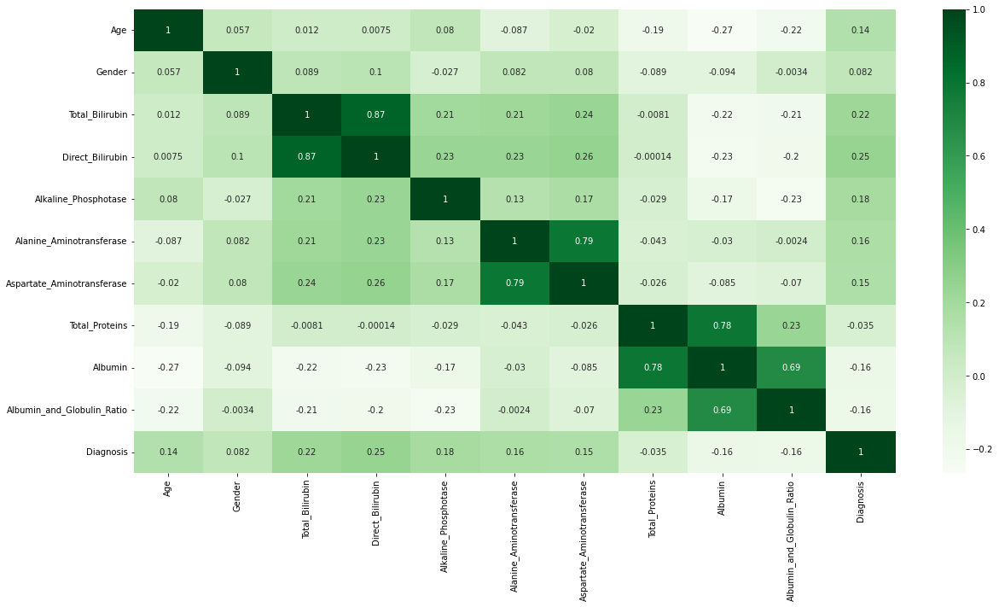
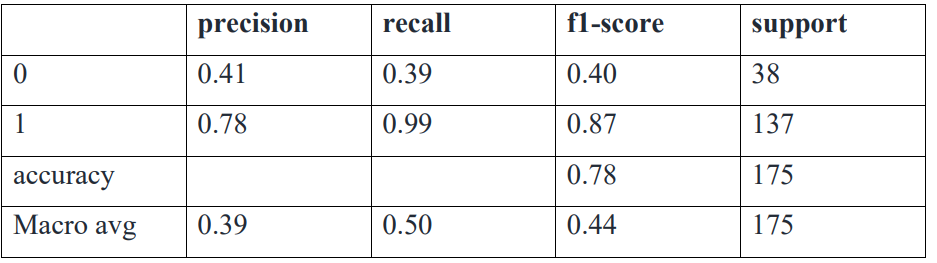

# Liver-disease-diagnasis-

In this project, we are going to use the Indian Liver Patient Records dataset . We will predict whether a patient has liver disease or not based on certain features. We are going to check with the total proteins, albumin, etc. whether it is associated with the disease or not.

## Dataset
The data set contains 416 liver patient records and 167 non liver patient records collected from North East of Andhra Pradesh, India. The "Dataset" column is a class label used to divide groups into liver patient (liver disease) or not (no disease). This data set contains 441 male patient records and 142 female patient records.

Any patient whose age exceeded 89 is listed as being of age "90".
(Data.

## Environment
We used *Python 3.6* for this project and implemented the code in *Jupyter Notebook*

## Code

The code for this project is written in Python . The code is available in the `liver-disease-EDA.ipynb` file. 

## Data Visualisation
### Age distribution of the patients

### Count Plot

### Correlation

## Results
The Support Vector Classifier (SVC) has been found to be the most effective for liver disease prediction. Its superior performance over other algorithms such as KNN, random forest, and logistic regression, indicates that SVC is the best choice for live disease prediction. Its ability to efficiently handle large datasets, its robustness to noise, and its high accuracy make it an ideal choice for such applications. With SVC, we can make more accurate predictions in real time, which can help in early detection of diseases and improve patient outcomes

### SVC

## Conclusion
In conclusion, machine learning algorithms have a significant role to play in healthcare research, and they are becoming increasingly important in liver disease research. By analyzing large datasets, identifying patterns, and making predictions, they are helping to uncover new insights into the causes and potential treatments of liver disease. As such, the use of machine learning algorithms in this field is likely to increase in the future and will continue to play a key role in improving our understanding of this important medical condition.

## Contributors

	-Sri Vishnu Priya Sangaraju
	-Srividya Chekuri
	-Sai Venkata Ajay Varma Alluri

